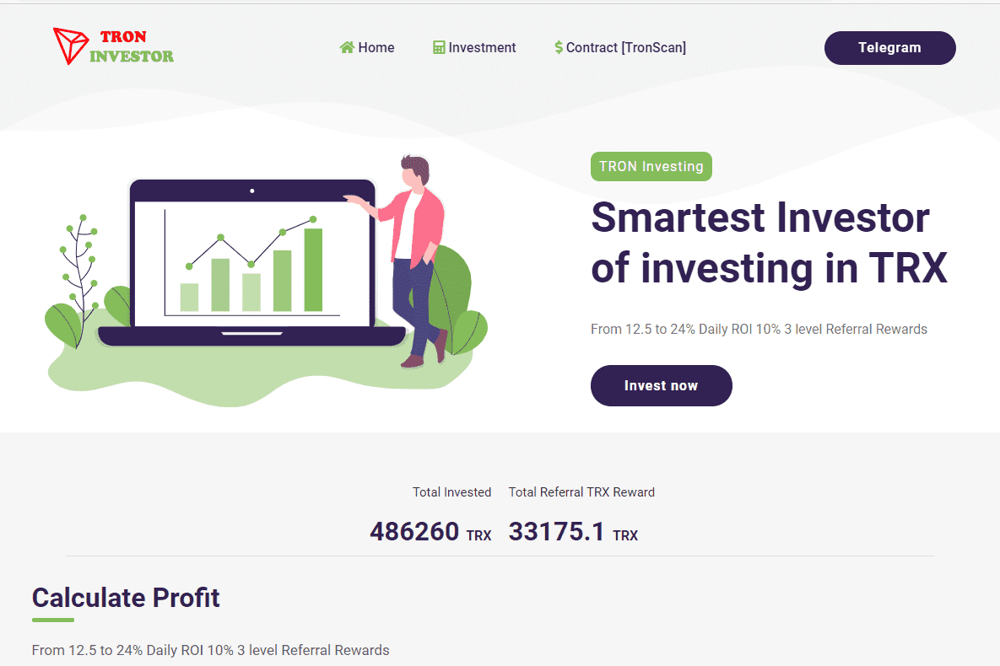

# Tron Investor

Smart TRON Investing，使用来自值得信赖的开发人员的新智能合约，每天在 TRX 中赚取 12.5% 至 24%。
邀请朋友并获得总计 10% 的推荐奖励。TRON 是一个去中心化的虚拟机，旨在帮助迎来去中心化的互联网。与以太坊类似，TRON 支持 Dapp ...波场基金会，基于区块链技术的去中心化内容娱乐协议。在这里，您可以找到有关他们的资金、投资者...TRON 是一项好的投资吗？尽管围绕它存在争议，但 TRON 仍是按市值计算的顶级加密货币之一。它当然有潜力，而且...

