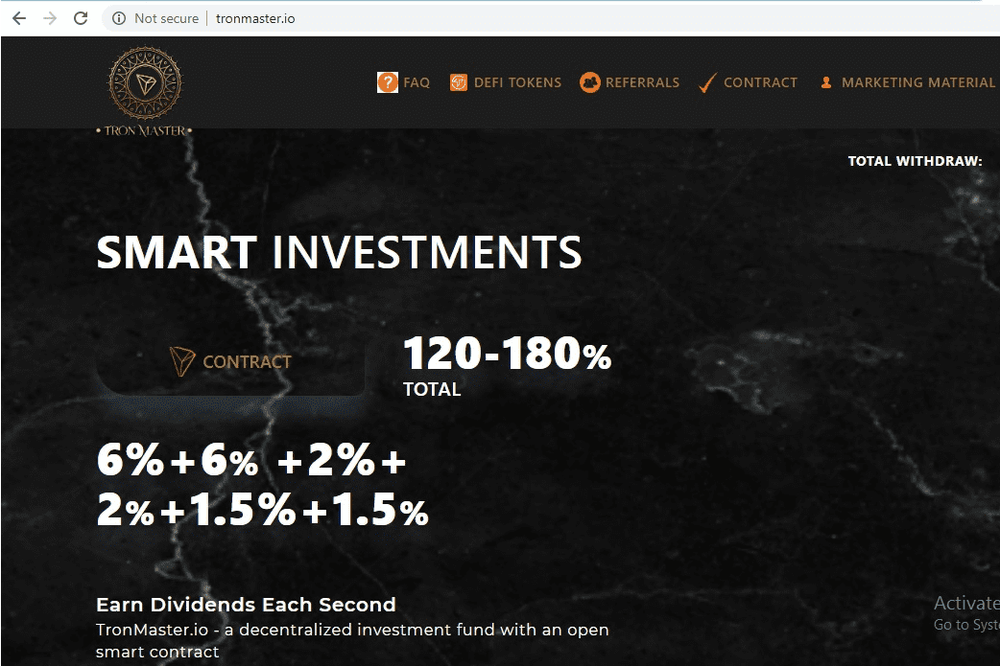

# Tron Master

Tron Master Project 是一个完全安全的区块链项目，拥有 Torn Scan 的绿色勾号。一个有着长远目标和大步骤的项目，可以为货币带来巨额利润。
Torn Master 的重点是迄今为止看到的所有项目的显着特征：
Point 1：这个项目不用担心大额提现，因为最大投资项目已经被用来防止智能接触鲸鱼了。
Point 2：盈利率是根据用户的提款来计算的。
Point 3：相对于其他项目的低手续费比例为百分之一，甚至通过项目提款的数量鼓励用户不支付费用。
Point 4：另一个重要的区别是推荐讨论，它是分六个级别支付的。
第 5 点：防止每伏假帐户的另一个区别特征是只能引用一个帐户。用于推荐的虚假帐户等于对主站点链接的推荐。
取款的准确和真实的计算计数器
拥有SSL数字证书，交易安全
如果您提款十次，您的利润将是 120%。
您的利润是根据您提款的次数来定义的。
该计划导致项目余额不再减少。
但是这个项目的重要转介
第一级：6% 第二级：6% 第三级：2% 第四级：2% 第五级：1.5% 第六级：1.5% 完美推荐

