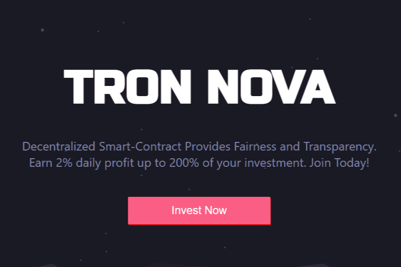

# Tron Nova

TronNova.app 是一个基于投资回报率（每天 2% 到 200%）的智能合约，您作为投资者将获得一个固定百分比，该百分比是根据您的投资商定的。
用户需要存入至少 100 个 trx 才能开始您的 TronNova.app 之旅。
用户可以提取或再投资您的 div。
当您点击提款时，50% 的利润将回馈至“再投资钱包”，用于再投资，50% 直接发送至您的钱包
再投资总是可以用来复合利润（当前股息）。合约的可持续性是合约中有资金的时候。当您再投资两件好事发生时，由于复利效应，合约余额不会减少，您的利润会增加。
根据投资金额分为3级推荐； 1 级 (10%)、2 级 (5%)、3 级 (3%)。所有推荐收入都会添加到再投资钱包中，因此您需要再投资才能开始赚钱。

