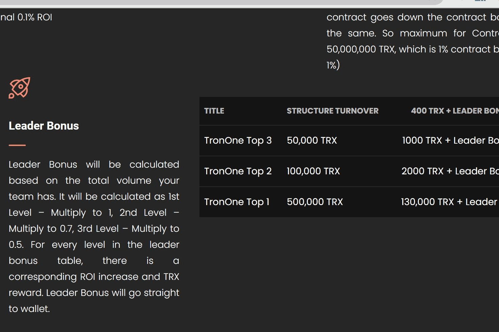

# Tron-OneV2

持有红利 合约红利 推荐奖励 领袖红利
网站：WWW.TRONONE.ME
电报：HTTPS://T.ME/TRONONE_OFFICIAL
合同地址：
HTTPS://TRONSCAN.ORG/#/CONTRACT/TESPGOMGW8A3AE7XPWKXDPSEM8JL1UGV8V/CODE
骗局是不可能的
💖长期项目
💖独特的COMPLAN
💖可持续平台
每 24 小时不提款，您将获得额外 0.1% 的每日投资回报率。当您撤回持有奖金重置。 （最多 1%）
对于我们在合同余额中的每 500,000，他们的投资将增加 0.1% 的每日投资回报率。这是固定的，这意味着即使合同下降，合同奖金也将保持不变。因此，合约红利的最大值为 50,000,000 TRX，即 1% 的合约红利。 （最多 1%）
推荐等级最高可达 3 级。推荐奖励将直接存入钱包。这意味着推荐佣金不会保留在您的余额中，而是直接进入您的钱包。第一级 – 5% 第二级 – 3% 第三级 – 2%
领导奖金将根据您团队的总数量计算。它将计算为 1 级 - 乘以 1，2 级 - 乘以 0.7，3 级 - 乘以 0.5。领导者奖金表中的每个级别，都有相应的 ROI 增加和 TRX 奖励。领袖奖金将直接进入钱包。

