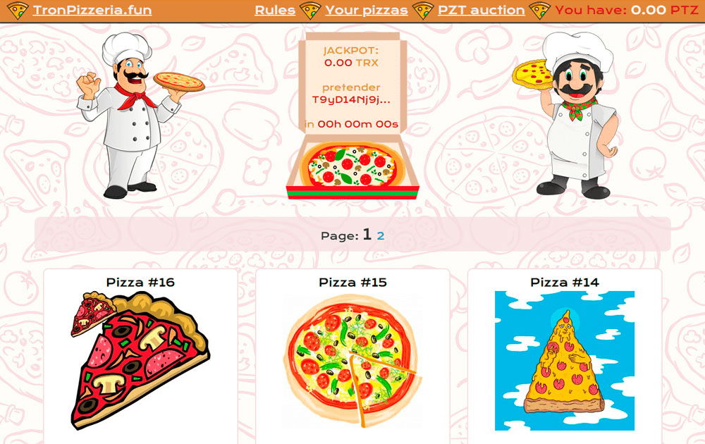

# Tron Pizzeria

购买披萨后，价格会上涨 33%。您可以用价格除以 2 将披萨更改为 2。您可以将披萨更改为 2，前提是其价格 >= 200 TRX。您将获得转售这两个比萨饼的红利（2.5%）。购买披萨后，您还将获得 PZT 代币。 PZT 代币可以： 1. 烧掉分红。 2. 在去中心化交易所出售。 3. 用于代币拍卖。 4. 用于购买一些比萨饼。注意力！将一个披萨换两个有佣金 - 披萨价格的 1%（但最低 100 TRX）。销售佣金：2.5% 给管理 + 2.5% 给比萨的创造者 + 1% 给 PZT 股息 + 4% 给 JACKPOT。 JACKPOT 计时器为 12 小时。最后一位买家将在 12 小时内获得 JACKPOT。

