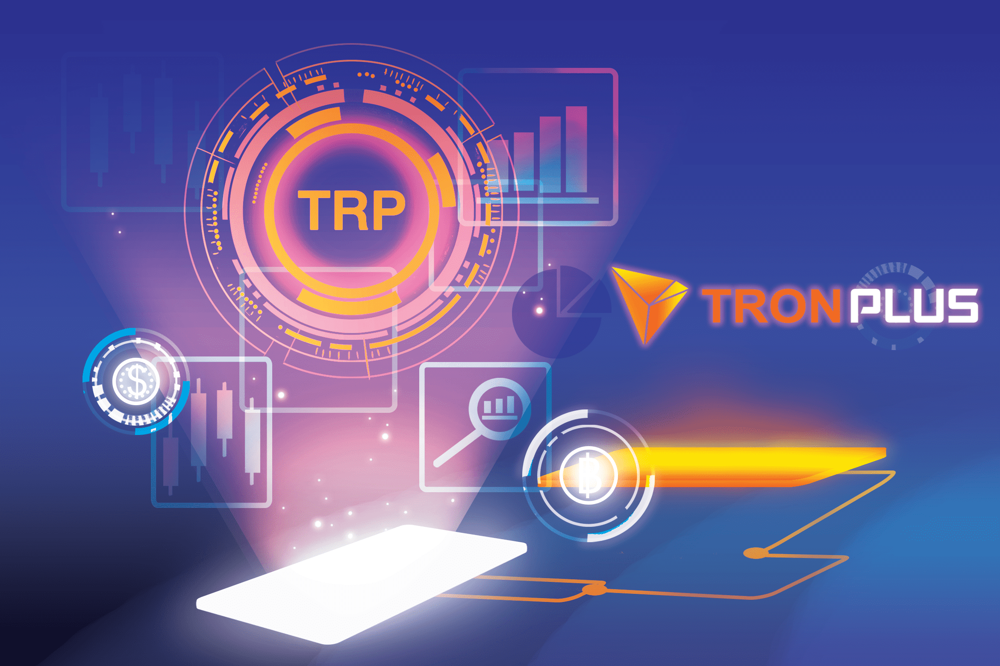

# Tron Plus Defi

💥💥自豪地介绍全新的社区基金计划💥💥
💎💎💎 TronPlus.io 💎💎💎
二、 Tron Plus DEFI 基金💰💰💰
- TRON PLUS DEFI 是一个基于社区的项目，100% 去中心化，通过 Tron Plus 智能合约进行 P2P 交易。
- 投资 - TRX，获得奖励 - TRX 并获得空投 - TRP。
- 社区基金将提取 10%（5% 用于开发团队，5% 用于 TRP 担保基金）。智能合约系统上已打开所有活动的计数。
四。如何投资？ 💵💴💶💷
- 通过在 Tron Plus 基金中投资至少 500 TRX，您可以从社区获得奖励（TRX），每个资金周期最高可达 360%。
- 当您收到 360% 的 LIMIT 并且重新投资的 TRX 数量必须等于或大于之前的投资金额时，您可以重新投资。
投资最少 500 TRX。
交易费用从 5-10 TRX 不等，因此您的账户必须有 510 TRX 的最低余额

