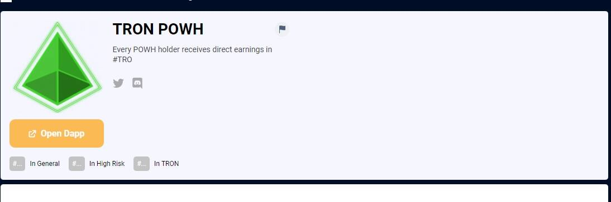

# TRON POWH

每次其他人根据代币数量购买、出售或转让代币时，每个 POWH 持有人都会在#TRON 中获得直接收益。*TRON*致力于构建真正的基础设施......当每个人在合并后时期都使用#ETH # *PoW时，所有人都希望成为第一个解决方案。**TRON*在过去 24 小时内上涨了 0.28%。当前 CoinMarketCap 排名第 16 位，实时市值为 6,055,772,320 美元。它有一个循环供应......2022 年 3 月 15 日— *Tron*是一种流行的基于区块链的操作系统，可以在其上创建去中心化应用程序并共享媒体内容。

