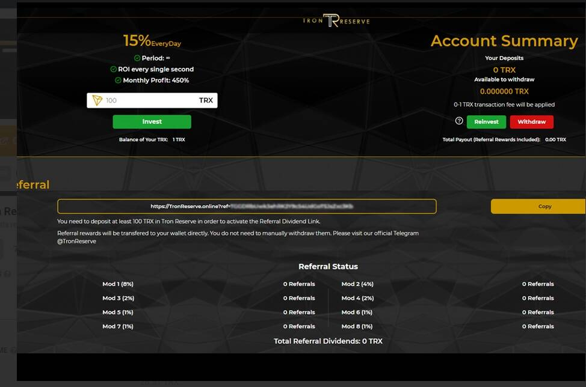

# Tron Reserve

什么是 Tron 储备？Tron Reserve 是一个回报丰厚的每日 Staking 智能合约。 Tron Reserve 在开发时考虑到了简单性和自动化，经久耐用。通过在储备金中存入并持有 Tron，用户将获得每日可按分钟提取的 Staking 分红。推荐和非常活跃的社区也是我们的一些最佳功能！快来加入 Tron 生态系统中最热门的 Dapp！质押您的 TRX 并终生每天赚取 15%。安全的。开源。欢迎来到 Tron 保护区*TRON* DAO *Reserve* (TDR) 致力于建立一个真正的#去中心化加密货币储备*，*赋予和维护经济主权和市场

