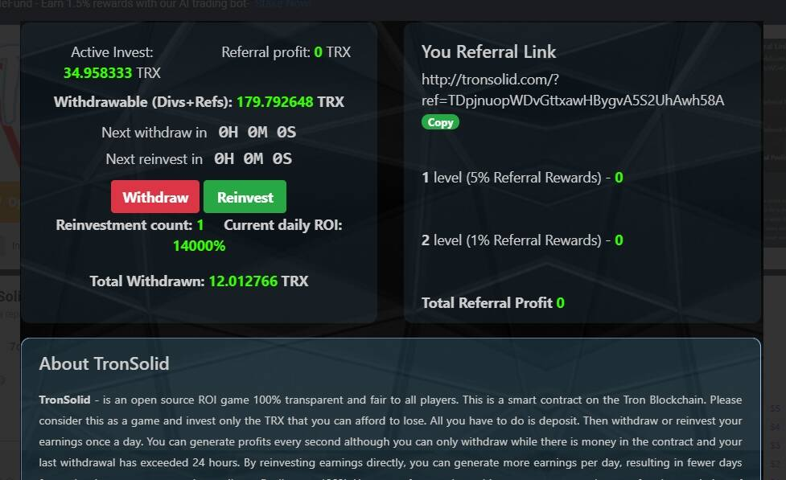

# Tron Solid

✅在 TRON 网络上验证✅
;🚀每天赚取 9% 🔥高达 180% 🔥
;💸 每 24 小时退出并重塑自己。
;⭐️ 每次再投资都会增加您的每日 ROl。
;👥 6% 总推荐佣金。
;💳 加入推荐链接可返现 1%。
;🔐 完全可靠且安全的合约。

Tron Solid 允许您投资 TRX。随着时间的推移，您将看到您的投资增长。预期回报应达到每天 9%。还有 6% 的推荐佣金。收入上限为 180% 的投资回报率。Tron Solid dApp 是一种基于Tron协议的高风险类别的加密资产。现在，根据用户数量，它在一般 dApp 排名中排名第 3002位，在高风险类别中排名第 572位，这让您可以很好地了解Tron SoliddApp 在其竞争对手中的表现。

通过分析过去 30 天窗口中的 Tron Solid dApp 数据，很明显 dApp 的余额为0.00美元，交易量稳定在0.00 美元。Tron Solid在 30 天内产生了0 笔交易，变化率为 0% 。显然，与之前的 7 天相比，成交量稳定了0% 。过去 7 天的数据显示，Tron Solid用户基数为0，稳定了0%。我们还建议查看Tron Solid 活动概览和智能合约平衡图表，了解这些重要指标如何随时间波动和变化。

