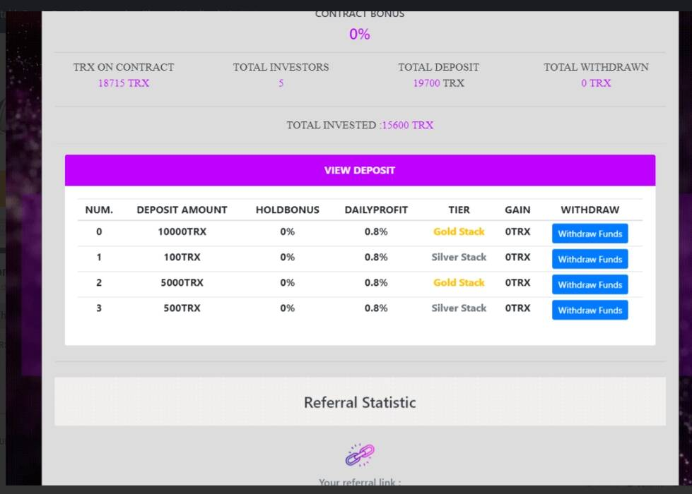

# Tron Stacks

Tron Stacks 智能合约是一个投资平台，每天以 +1% 至 240% 的总回报率赚取经常性 TRX 收入。 Tron Stacks 具有 P2P 推荐计划，可向投资者支付高达 5 级的深度。 Tron Stacks 的设计考虑了最终用户！5 级 P2P 推荐系统 - 立即开始赚钱！ &nbsp;🔥您需要为您的参考链接进行 1 存款才能激活。 （最少 100 份）-复制推荐链接并开始建立您的 P2P 团队！每天至少赚取 1%+0.08% 每日持有红利+0.01% 合约红利（每 100 万 TRX）Silver Stack：最少 100 TRX - 获得高达 150% 的投资回报率Gold Stack: 5,000 TRX Min - 赚取高达 175% 的投资回报率白金堆栈：至少 20,000 TRX - 获得高达 200% 的投资回报率Ruby Stack：最少 50,000 TRX - 获得高达 240% 的投资回报率每次存款单次取款，每层无限次存款！

