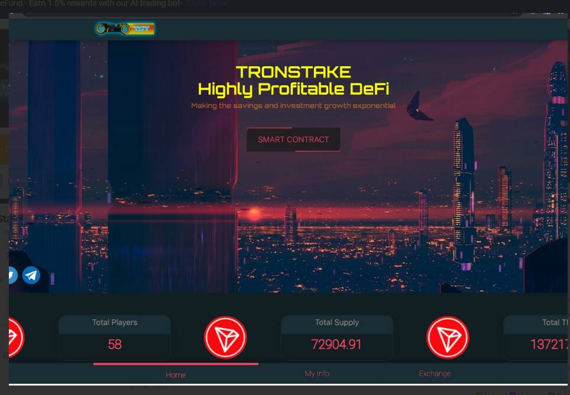

# Tron Stake (TST)

随着时间的推移，第一个真正盈利且可持续的智能合约。旨在鼓励保存 $TRX 加密货币。以市场上最高的储蓄增长率
波场股权代币（TST）
TST 代币是通过去中心化交易所创建并通过它销毁。因此，货币供应量是可变的，每个用户都是defi的股东，从去中心化交易所进行的每笔交易中获得被动股息。购买费 8% 销售费 20%，只要持有代币，就无限分配给持有人
使用增加的加密货币是一种价值增加的加密货币
之前开采的代币数量为零。
TST 创建了第一个具有 defi 参数的去中心化投资银行，使所有 TST 持有者产生被动收入，同时也利用货币价格的增长，因为在 TST 中每购买 5000 TRX，其价格上涨 0.06 TRX /0.10 TRX
从区块链中获得利润的 3 种方式
股息红利
当您对 TST 进行投资时，您购买的 8% 将用于所有 TST 持有者的股息池。这是 100% 被动的全球利润
直接奖金
邀请玩家加入TST智能合约，获得直接玩家投资5%的佣金。你可以只有两条腿，但无限的直接伙伴
矩阵奖金
选择您想在您的组织中委托的深

度，从 20 代到 50 代，从溢出中获得利润
