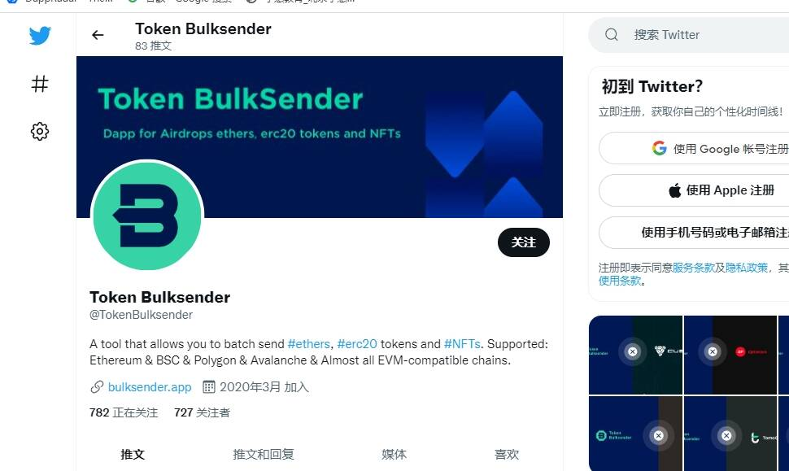

# TRON Token Bulksender

这是一个 dApp，用于通过少量交易将 TRX 和 TRC20 代币批量发送到多个地址，这将为您节省更多时间和 tx 一个允许您批量发送[#ethers]、[#erc20代币和[#NFTs](的工具。支持：以太坊 & BSC & Polygon & Avalanche & 几乎所有与 EVM 兼容的链。费用您可以在一次交易中将[$CUBE](、CRC-20 代币和[#NFT 批量]发送到多个地址！这是一个 dApp，用于通过少量交易将 TRX 和 TRC20*代币*批量发送到多个地址，这将为 ...欢迎来到。*TRON BulkSender*。支持波场主网*Shasta*测试网。TRON Token Bulksender*是一个非常有用的去中心化应用程序。您可以使用它一次将 TRC20 和 TRX 代币发送到多个地址。

