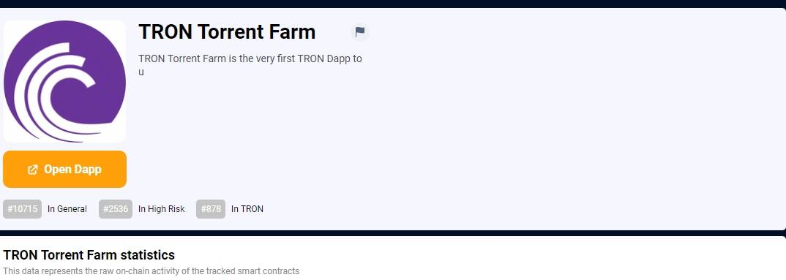

# TRON Torrent Farm

TRON Torrent Farm 是第一个使用 TRC10 代币（BTT）代替 TRX 的 TRON Dapp！在 TRON Torrent Farm 中，您购买播种机，每个播种机每天产生 1 个 Peer。生成的 Peers 可以转换为 Seeder 以进行额外生产或出售以换取 BTT。 Peers 的买入和卖出价格是由“市场”的涨跌决定的——其他玩家主要是买入还是卖出。高风险，暴利。*TRON Torrent Farm*是第一个使用 TRC10 代币（BTT）代替 TRX 的 TRON Dapp！在*TRON Torrent Farm*中，您购买播种机，这些播种机在 ...

