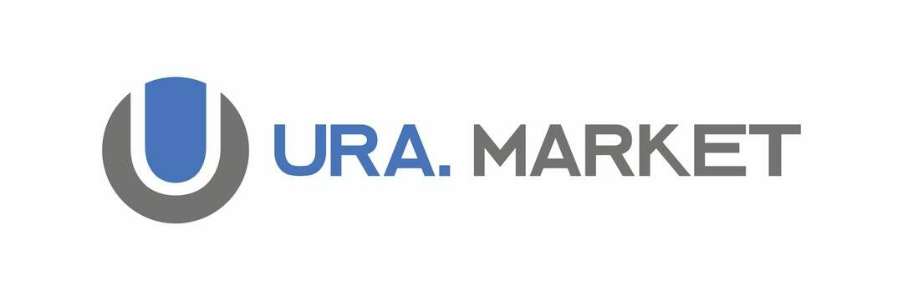

# TRON ura market

ura.ink 是一个去中心化的贸易和投资平台，由 tron net 创建。 ura.ink 在无人参与的情况下由自动智能合约控制，并拒绝所有权激活功能

我们的技术为地球上的任何居民提供了获得被动收入的机会，超过了传统企业、加密基金投资和经典股票市场的盈利能力。 加入我们！

我刚刚发表了区块链的扭曲镜像，或者说分布式经济系统的起源……

智能合约的固定规则和在线执行确保了平台的高盈利能力和中等风险。 加入我们！

持有者出售的所有代币都会自动销毁，以当前汇率换取 ETH。

