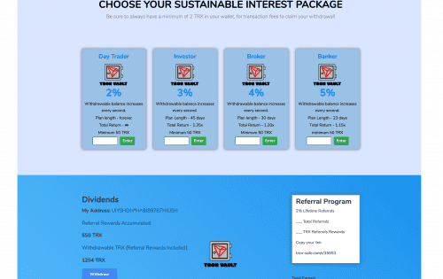

# Tron-Vault

Tron Vault 是您 TRX 的储蓄账户。 该合约旨在将收到的资金 100% 重新分配给所有玩家！
通过将您的资金存入智能合约，您立即开始赚取所选的每日利息，即您决定保存在保险库中的金额。 您收到的每日津贴金额将根据您选择的计划的长度和费率而有所不同。
计划从每天 2% 到 5% 不等，持续 23 天、30 天、45 天或终生。
最低入场金额为 50TRX。
最低提款金额为 50 TRX。
有 10% 的提款费。 这笔费用旨在帮助使合同在长期内更具可持续性。
提款费会自动在 Day Trader Lifetime 2% Daily Plan 下进行再投资，因此即使您的计划到期，您也可以继续赚钱！

