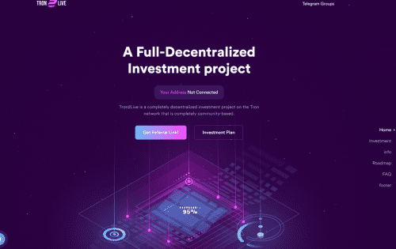

# Tron2Live

每日利润基数永远为 2%。 合约余额每增加100万TRX，所有会员每日收益增加0.2%，达到2000万TRX后，收益固定为4%。 因此，没有人每天的收入会超过 4%，这对项目的生存有很大帮助。Tron2Live 是 Tron 网络上一个完全基于社区的完全去中心化的投资项目。

如果 tron2live.com 为您提供交易建议或投资机会，您应该检查它们是否受到监管，因为它们可能违反法律。

这些类型的网站被称为 HYIP（高收益投资计划），并且以通过向世界做出承诺而一无所获来骗取人们所有的钱而闻名。tron2live.com 似乎主要通过电话营销和在 Tiktok 和 Instagram 等社交媒体上发帖向欧洲和美国的客户进行营销。

