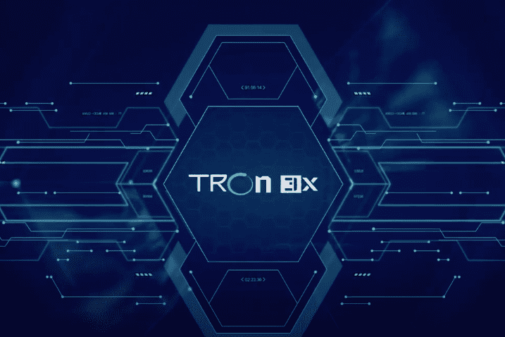

# Tron3x

欢迎来到 TRON3X.IO 最可持续和完全去中心化的 100% TRON 支持模型，基于智能合约技术 TRON3X 智能合约旨在为每个人提供基于区块链和智能合约技术的独立财务基础。通过将 TRX 存入基金（合约地址），您将激活程序并将收到 300% 的返还，根据合约算法分配。 TRON3X 100% 去中心化和社区化；系统没有额外的利润，它是一种P2P支持模式，它确保了所有人的公平、透明和公正。没有调解人或中间人，没有所有者，没有公司或人的互动，根据智能合约的规则有效地保证了所有参与伙伴的公平性。是目前最合理、最安全、最前沿的金融支持模式。通过向基金存入至少 100TRX 进入 TRON3X。您现在有资格获得 300% 的押金返还 300% 的回报以 4 种方式返还：2% 的每日押金回报（最多 150 天），100% 被动。 : 10% 直接推荐佣金用于分享和发展社区基金 : 每日匹配佣金基于合作伙伴每日收入, 为每个直接合作伙伴激活 1 个级别, 最多 15 个级别, 见下文 : 每日顶级推荐人池 3% 的所有存款预留水池;每 24 小时，池的 10% 由交易量排名前 4 位的赞助商共享 *TRON3X 是一个基于社区的项目，100% 去中心化，通过智能合约进行 P2P 交易。 *每个存款周期为 300% *最低入金为 100TRX，对所有参与者开放，没有限制。

