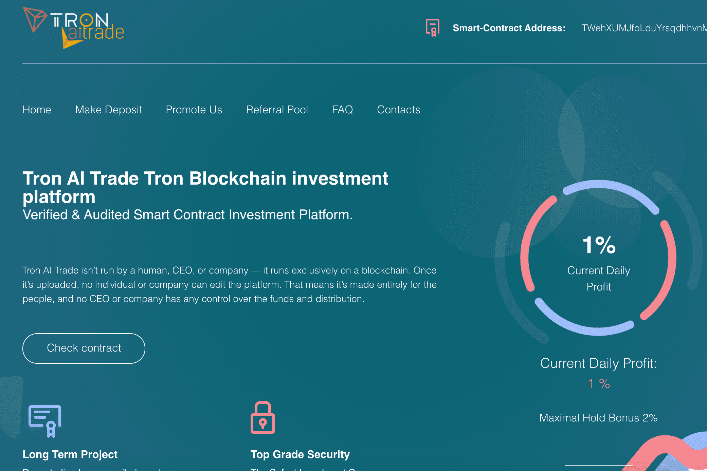

# TRONAITRADE

赚取 +500% 的存款 区块链去中心化和匿名平台 基于 TRX 智能合约的完全安全的收入 15 级统一奖励
从您的存款中获得高达 500% 的交易利润
加入TRONAITRADE
赚取最高 12.5% 推荐奖金
和高达 115% 的统一奖金

RONAITRADE dApp 是一种基于 Tron 协议的高风险类别的加密资产。 现在，根据用户数量，它在一般 dApp 排名中排名第 2443 位，在高风险类别中排名第 708 位，这让您可以很好地了解 TRONAITRADE dApp 在其竞争对手中的表现。

通过分析过去 30 天窗口中的 TRONAITRADE dApp 数据，很明显 dApp 的余额为 0.00 美元，交易量稳定在 0.00 美元。 TRONAITRADE 在 30 天内产生了 0 笔交易，变化为 0%。 显然，与之前的 7 天相比，成交量稳定了 0%。 最近 7 天的数据显示 TRONAITRADE 用户基数为 0 并且稳定了 0%

