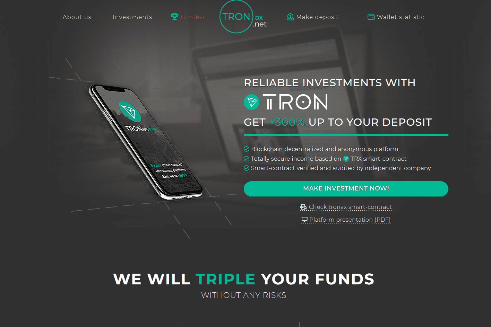

# TRONax

赚取 +300% 的存款！ 具有经过验证的智能合约的可信、诚实和正式注册的平台。 附属公司：7-2-0.5%

关于我们
全球地点 领导力 我们的价值观 可持续性
在六大洲拥有约 6,500 名员工，我们丰富的多样性、无与伦比的垂直整合模式以及在整个价值链中无与伦比的运营和技术专长，将 Tronox 定位为全球卓越的钛白粉生产商。

Tronox 在纽约证券交易所上市，股票代码为 TROX。

