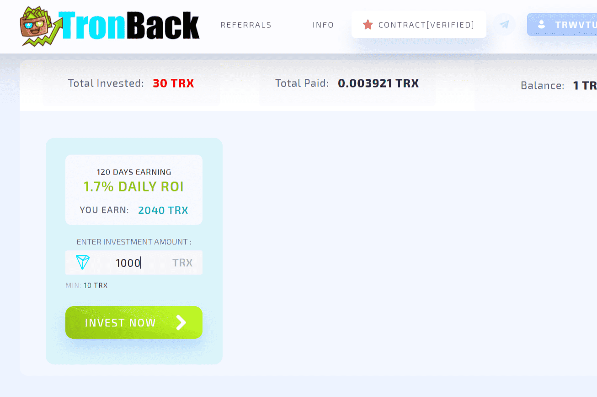

# TronBack

通过推荐新用户赚取额外收入。 一个三级推荐计划，每次受邀投资者投资我们的计划，您可以获得 5% + 4% + 1% 的收益。
TronBack 智能合约每天产生 1.7% 的投资金额，并保证 1.7% 的收入，直到您获得 204%

自 5 月加密市场下跌以来，与其他链相比，TRON 的表现非常好。

其在总 TVL（在所有连锁店中）的市场份额几乎翻了两番，从 1 月 1 日的 2% 增长到 6 月 30 日的 6%。作为参考，第二高的增长是 BSC，从 7% 增加到 8%，而一些，如 Solana 和多边形，拒绝了。

TRON 现在拥有仅次于以太坊和 BSC 的第三高 TVL，但与 Solana 或 Avalanche 相比，它的兴奋程度几乎不一样。

