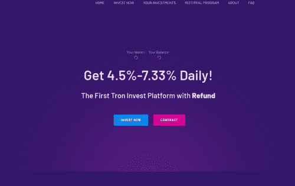

# TronBank

每24小时获得1.8%~4.8%的收益，每秒可以提现，是一款全球玩家共同参与的金融游戏，它构建在波场Tron链上，完全由智能合约自主运行。 1.8%~4.8% daily ROI. Allow to withdraw every second. TronBank is a fund game that has attracted many global players. It is built on TRON network and runs autonomously based on the smart contract.

TRONBANK 是一个 ROI 项目，在合约余额足够的情况下，用户可以在 4 - 10 天内至少投资 50 TRX 并获得 140% - 250% 的 ROI

什么是 TronBank？
TRONBANK - 基于TRX区块链智能合约技术的投资平台。 安全合法！

​            

  二、 投资条件

  * - 最低存款：50 TRX，没有最高限额

  * - 总收入：根据您的投资计划（每天从 25% 到 35%）高达 250% 的投资回报率

  * - 投资者必须在每个投资期结束后重新投资以赚取更多收益

  * - 每秒收益，随时提款（您只能在投资结束后提取可用资金余额）

  三、 会员计划

 

    - 4级推荐佣金：4% - 3% - 2% - 1%

四、资金分配

    - 82.5% 平台主要余额，参与者支付
    
    - 5% 广告和促销费用
    
    - 5% 联盟赞助商奖金
    
    - 5% 支持工作、技术运作、管理费
    
    - 2.5% 的保险费，用于定期再投资于基金

