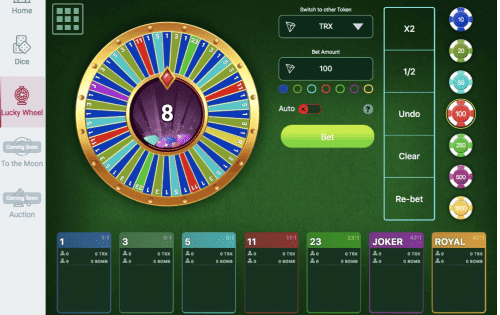

# TronBomb

1. 平台分红模型 • 平台作为利润获得的所有资金形成分红池，并在项目代币持有者之间分配。 • BOMB 代币在每次下注后奖励给用户。 • 股息池中的资金分配由智能合约每 24 小时进行一次。在我们网站的股息部分，您可以看到一个倒计时，直到下一次资金分配。 2. 平台的社会化： • 排名系统允许用户根据下注的数量来提高他们在系统中的等级。 • 在线聊天帮助用户讨论游戏策略、项目开发，并扩展、加强TronBomb 平台社区。 • 多人游戏会增加很多情感并增加游戏的参与度。 • 多级推荐系统将让平台推广者获得高额奖励，吸引新用户和玩家增加他们的奖金。 3. 累积奖金系统： • 5 名最大的玩家将每 24 小时获得一次投注量的奖励。 • 每过去24 小时，20 位幸运的TronBomb 平台用户将获得随机奖金。 4. 拍卖系统 • 部分分红池资金转入拍卖基金，可供拍卖参与者购买项目代币。 • 从拍卖中获得的所有代币都将被烧毁。

