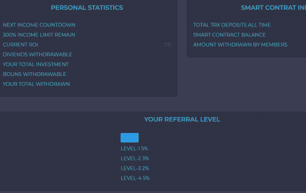

# TronBoom

什么是 TronBoom？
🧬 分钟。 存入 100 TRX。
🧬 基于投资回报率的投资平台，提供 3.5% 至 7.5% 的每日投资回报率。
🧬 15% 推荐佣金。
💸 每 24 小时提款一次。
🟣100% 验证和审核。
👥 推荐：15%
5% 一级
3% 二级
2% 三级
5% 四级

它由新加坡一家名為Tron Foundation的組織於2017年創立，由首席執行官賈斯汀·孫（Justin Sun）運營，並擁有一支專門的內部開發團隊來推進該項目。

通過利用區塊鍊和點對點技術的獨特功能，Tron致力於消除娛樂中間商（例如Netflix或Amazon之類的公司），並允許內容創建者直接接觸消費者。結果將為所有相關人員帶來更便宜的成本，並為內容創建者帶來更多控制權。

消費者可以使用Tron加密貨幣來支付他們想要在網絡上訪問的內容的費用。

