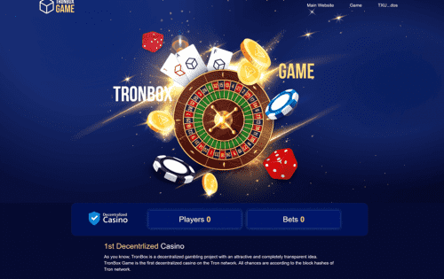

# TronBox Game

TronBox Game 是 Tron 网络上的第一个去中心化赌场。 所有的机会都取决于 Tron 网络的区块哈希。 在 TronBox 游戏中，用户可以预测下一个区块哈希的最后一个字符并对其下注。
如何玩 TronBox 游戏？
有两组字符，您可以选择其中一组。 如果下一个块哈希的最后一个字符与您选择的组中的一个字符匹配，则您获胜。
TronBox Game 是去中心化的，赢得用户的唯一因素是他们的机会。

