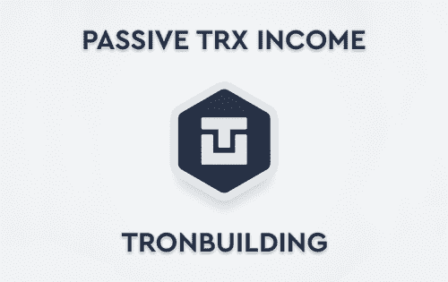

# TronBuilding

Tron Building 是一项基于 Tron Network 区块链的令人兴奋的城市建设经济战略，您可以在其中每天赚取 20% 到 150% 的 TRX 加密货币。 选择自己的商业帝国发展战略，明智地分配收入以获得更多利润，与其他玩家争夺排行榜的一席之地，发展和改进自己的生产并享受结果！

它提供了一项融资计划，其中包括购买在 18 至 65 天内产生 120% 至 254% 利润的建筑物。 建筑物的成本在 154 TRX 和 39,200 TRX 之间。 利息按小时支付，50% 留作回购。

