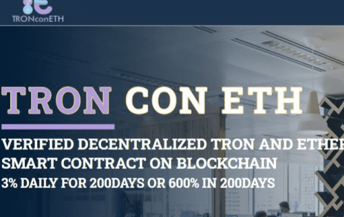

# TRONconETH

基于以太坊和 Tron 基础的去中心化验证智能合约。 它在 200 天内提供 3% 的每日利润，其中 200trx 作为 Tron 的最低投资和 50 美元

智能合约、DApp、发币2.0，扎根于以太坊（Ethereum），这3个东西的结合可以构造出一种叫做区块链2.0的东西，而基于区块链2.0可以造出一种叫做：发行者“无法控制”的代币的东西。而这种发行者“无法控制”的代币可以作为许多平台类产品“积分”的升级换代产品。是现在以太坊，或者说整个区块链世界里很火的一个概念。

