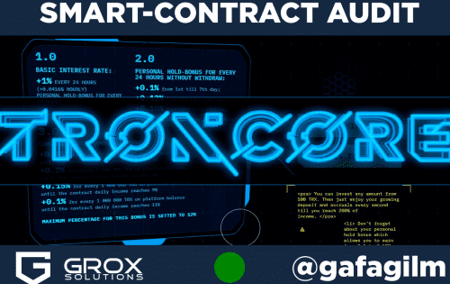

# TronCore

官网：troncore.net
【投资条件】
基本利率：每24小时1%（每小时+0.0416%）
平衡奖金计划
每 24 小时个人保留红利，无需提款：
从第 1 天到第 7 天 +0.1%；
第 7 天至第 14 天为 0.13%；
第 14 天至第 21 天为 0.15%；
0.17% 从第 21 天到永远
合约总金额赠金：
平台余额每 1 000 000 TRX +0.25%
直到合约日收益达到3%
平台余额每 1 000 000 TRX +0.2%
直到合约日收益达到6%
平台余额每 1 000 000 TRX +0.15%
直到合约日收益达到9%
平台余额每 1 000 000 TRX +0.1%
直到合约日收益达到11%
合同奖金的最高百分比设置为 12%
总收入：200%（包括押金）
最低存款：100 TRX，无上限
每时每刻收益，随时提现
[附属计划]
3 等级从 3 到 5 级推荐佣金
自动回馈功能
由独立公司“GROX Solutions”审核

