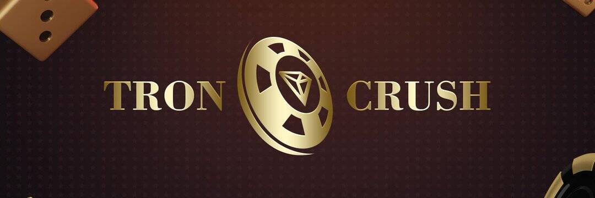

# TronCrush

凭借完全独特的设计，TronCrush 旨在为玩家提供真正可持续的红利。

根据 dapp.com 2018 年 d'app 市场报告，自去年第四季度以来，博彩 d'apps 占据了市场的主导地位。 第四季度的总交易量接近 30 亿美元，几乎占 2018 年总交易量的 44%。然而，游戏乏味、寿命短等问题也出现并越来越严重。 为了解决这些问题并为玩家提供全新的游戏体验，推出了 TronCrush。
TronCrush 是一款基于 TRON 区块链的独特投注游戏。 受 Candy Crush 的启发，它同时具有娱乐性和盈利能力指标，玩家可以在其中获得乐趣、获胜并不断获得红利。 游戏中共有 3 个骰子。 玩家需要一一玩。 掷骰子时，将根据结果和赔率立即发送奖金。 当所有 3 个骰子都打完时，一轮就完成了。 然后玩家将能够根据他们的幸运数字组合获得额外的奖金。

