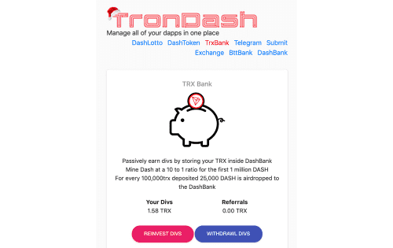

# TronDash TRX Bank

通过将 TRX 存储在 DashBank 中被动赚取 div
前 100 万个 DASH 以 10 比 1 的比例开采 Dash
每存入 100,000 个 trx，将 25,000 个 DASH 空投到 DashBank 通过将您的 TRX 存储在 DashBank 中以 10 比 1 的比例挖矿 Dash 以 10 比 1 的比例获得 div 每存入 100,000 个 trx，25,000 个 DASH 被空投到 DashBank

存款/取款收取 10% 的交易费 9% 分配到红利池 1% 用于推广和发展

TronDash TRX 银行允许您将 TRX 存储到平台中。 反过来，这会增加您随着时间的推移获得的 div。 dApp 还允许您挖掘 DASH。 这是一种通过将您的 TRON 加密货币存储在平台上来赚取被动收入的方式。 也有空投。

