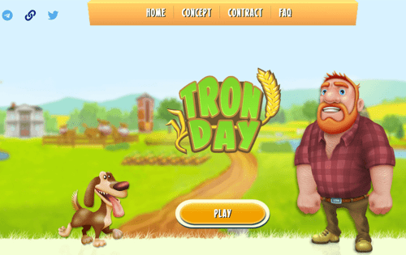

# TronDay

特隆迪© ; - 是一款经济战略游戏，您可以在 Tron 加密货币中获得金钱奖励。 成为我们项目的一员，您可以经营自己的业务，收购和开发您的产品，从而产生真正的利润。 每天玩游戏并赚取加密货币 Tron！

经济战略的基本特征可概括为： [1] 

(1)全局性。研究对经济发展全局有指导意义的规律和对系统总目标实现有决定意义的因素；

(2)长远性。不仅影响经济系统的整体发展，而且对经济发展的方向及其发展的全过程自始至终发生作用；

(3)综合性。在经济战略制订中，任何一种战略都不是单一的，都必须综合考察各种因素的作用与影响，如科技、经济、社会、政治、环境的相互渗透和协调发展问题以及综合国力的发展等；

(4)层次性。经济系统结构具有层次性，这就决定了经济战略也具有层次性，即各个子战略应该服从于整体战略。经济战略与经济规划之间是相辅相成、互为依存的关系。

经济战略强调经济在一个较长时期内所要达到的主要目标和要采取的重大措施，其特点是时期长、内容具有方向性和原则性；而经济规划则是把经济战略的任务、措施具体要求和规定下来，并在相对短的时间内化为具体指标，并下达执行，对社会经济活动起着直接指导和支配作用。经济战略是经济规划的指导纲领，经济规划是经济战略的具体部署，从层次性而言，经济战略处在国民经济决策体系中的高一层次，或最高决定，而经济规划则处在低一层次。经济战略是经济规划的指导，同时，经济战略必须接受经济规划的反馈，必要时调整经济战略目标或措施，使经济战略不断完善。

