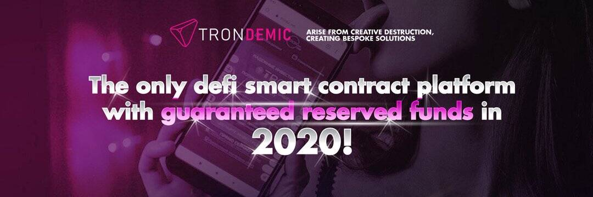

# TRONDEMIC

什么是流行病？
💯𝐃𝐄𝐂𝐄𝐍𝐓𝐑𝐀𝐋𝐈𝐙𝐄𝐃/𝐎𝐏𝐄𝐍 𝐒𝐎𝐔𝐑𝐂𝐄
💯𝗩𝗘𝗥𝗜𝗙𝗜𝗘𝗗 𝗦𝗠𝗔𝗥𝗧 𝗖𝗢𝗡𝗧𝗥𝗔𝗖𝗧
💯𝐁𝐀𝐂𝐊𝐔𝐏 𝐑𝐄𝐒𝐄𝐑𝐕𝐄𝐃 𝐅𝐔𝐍𝐃
💯𝐀𝐍𝐓𝐈 𝐅𝐑𝐀𝐔𝐃 𝐒𝐂𝐇𝐄𝐌𝐄𝐒
💯𝐏𝐑𝐎𝐕𝐄𝐍 𝐏𝐀𝐒𝐓 𝐏𝐄𝐑𝐅𝐎𝐑𝐌𝐀𝐍𝐂𝐄
🌐首个通过“权益证明”权威（PoSA）共识机制、山寨币套利交易、质押和 YFI Yield Farming 产生利润的 defi 智能合约平台
🌐每日利率从 3.3% 到 6.6%
🌐附带有趣的𝙍𝙀𝙁𝙀𝙍𝙍𝘼𝙇奖金5%,3%,2%

📣📣📣于 10 月 2 日推出📣📣📣 加密基金管理组织，每日盈利。创造财富是我们的首要任务。 进入 DApp、Defi 和 PoSa 机制

