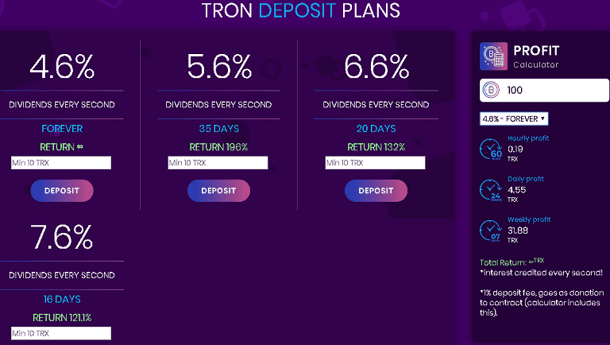

# TronDeposit

TronDeposit 是一个建立在 tron 区块链上的投资管理系统，具有经过验证的智能合约。

选择您的计划，从 3 到 30 天，每天获得 34.67% 到 7.07% 的利润，您保留存款的时间越长，您的利润就越大。

TronDeposit DAPP 技术分析
TronDeposit dApp 是一种基于协议的高风险类别的加密资产。 现在，根据用户数量，它在一般 dApp 排名中排名第 583 位，在赌博类别中排名第 416 位，这让您可以很好地了解 TronDeposit dApp 在其竞争对手中的表现。

通过分析过去 30 天窗口中的 TronDeposit dApp 数据，很明显 dApp 的余额为 0.01 美元，交易量看涨，为 0.00 美元。 TronDeposit 产生了 0 笔交易，在 30 天内下降了 0%。 显然，与之前的 7 天期间相比，交易量下降了 0%。 最近 7 天的数据显示，TronDeposit 用户基数为 0，并且一直在增长 0%。

我们还建议查看 TronDeposit 活动概览和智能合约余额图表，了解这些重要指标如何随时间波动和变化。

