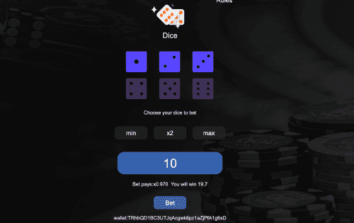

# TronDice

最初，Sun 和他的团队的计划是让 Tron 只在亚洲运营，但现在很明显 Tron 是一个全球区块链平台。 在撰写本文时（2021 年 9 月），Tron 拥有超过 5000 万个帐户。 Tron 旨在实现的主要目标是成为一个全球性的娱乐系统，用于经济高效地共享数字内容。

Tron 用户在区块链网络上的主要功能是点对点 (P2P) 网络系统，因此消除了中间人，从而允许内容创作者将他们的作品直接出售给买家。 它的口号是“去中心化网络”，当我们谈论他们的主要关注点和目标时，这不言而喻。

波场 vs 以太坊

Tron 网络结构与以太坊网络上的结构非常相似。 事实上，Tron 因可能复制过多 ETH 网络系统而不是创建其平台的独特基础而受到批评。

然而，有迹象表明，由于交易费用较低且速度比以太坊更快，因此加密货币交易者正在转向 Tron。 例如，其中一个迹象可能是，在 Tron 团队宣布推出支持后不到 30 天，在 Tron区块链上流通的与美元挂钩的加密 USD Coin 的供应量就超过了 1.08 亿美元。

Tron 有 6 个不同的里程碑，应该在 6 个不同的阶段完成：Exodus、Odyssey、Great Voyage、Apollo、Star Trek 和 Eternity。 在每个阶段之后，Tron 将在区块链世界中变得越来越重要。

Tron区块链上的热门项目

由于 Tron区块链网络正在发展并成为一个全球性的加密事物，因此有很多有趣的项目在那里运行。 让我们仔细看看一些顶级项目。

