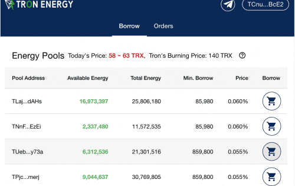

# TronEnergy.io

TronEnergy.io DAPP 技术分析
TronEnergy.io dApp 是基于 Tron 协议构建的 Marketplaces 类别的加密资产。 现在，根据用户数量，它在一般 dApp 排名中排名第 506 位，在 Marketplaces 类别中排名第 33 位，这让您可以很好地了解 TronEnergy.io dApp 在其竞争对手中的表现。

通过分析过去 30 天窗口中的 TronEnergy.io dApp 数据，很明显 dApp 的余额为 46.79 美元，而交易量以 7.5 万美元看涨。 TronEnergy.io 在 30 天内产生了 3.6 万笔交易，增长了 39.44%。 显然，与之前的 7 天相比，成交量已经暴跌了 -26.42%。 过去 7 天的数据显示，TronEnergy.io 用户群为 320，增长了 4.92%。

我们还建议查看 TronEnergy.io 活动概览和智能合约平衡图表，了解这些重要指标如何随时间波动和变化。

