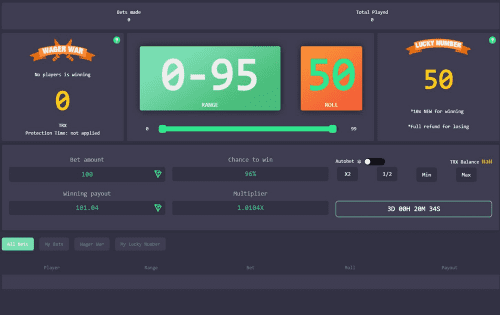

# TRONEW

TRONEW 是一款去中心化的骰子游戏，玩家在中到幸运数字时有很大机会获得全额退款。 游戏每 12 小时派发一次红利，每次 100%。

TRONEW DAPP技术分析
TRONEW dApp 是一种基于 Tron 协议的赌博类别的加密资产。 现在根据用户数量，它在一般 dApp 排名中排名第 5321 位，在赌博类别中排名第 602 位，这让您可以很好地了解 TRONEW dApp 在其竞争对手中的表现。

通过分析 TRONEW dApp 最近 30 天窗口中的数据，很明显 dApp 的余额为 0.00 美元，交易量稳定在 0.00 美元。 TRONEW 在 30 天内产生了 0 笔交易，变化为 0%。 显然，与之前的 7 天期间相比，交易量稳定了 0%。 最近 7 天的数据显示 TRONEW 用户基数为 0 并且稳定了 0%。

