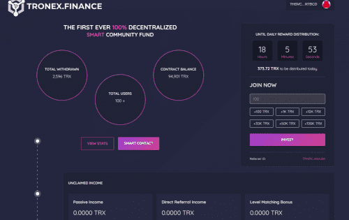

# Tronex FInance

Tronex Finance DAPP技术分析
Tronex FInance dApp 是基于 Tron 协议构建的高风险类别的加密资产。 现在，根据用户数量，它在一般 dApp 排名中排名第 4336 位，在高风险类别中排名第 1592 位，这让您可以很好地了解 Tronex FInance dApp 在其竞争对手中的表现。

通过分析过去 30 天窗口中的 Tronex FInance dApp 数据，很明显 dApp 的余额为 0.62 美元，交易量稳定在 0.00 美元。 Tronex FInance 在 30 天内产生了 0 笔交易，变化率为 0%。 显然，与之前的 7 天期间相比，交易量稳定了 0%。 过去 7 天的数据显示，Tronex FInance 用户基数为 0，并且稳定了 0%。

我们还建议查看 Tronex 金融活动概览和智能合约余额图表，了解这些重要指标如何随时间波动和变化。

Tronex FInance，也称为 TRON Crowd Sharing 平台，是第一个完全透明的以社区为中心的去中心化智能基金。

