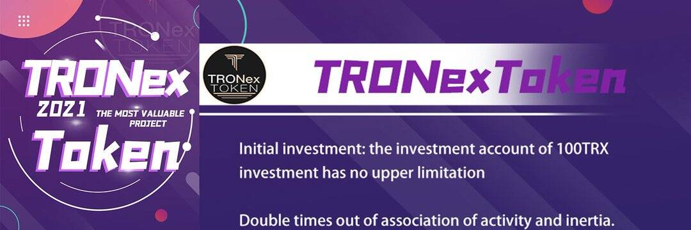

# TRONEX TOKEN LTD

波场超级节点合伙人团队基于TRX智能合约去中心化投资理财平台，通过合约发起所有链上协议的执行，确保投资者资金安全和规则的公平透明。 TRONex旨在依托TRON的技术优势和国际认可度，打造前所未有的DAPP金融生态。
在智能合约系统中，代码即规则，设定的条约在系统中自动触发执行，不可篡改。任何人为或自然因素都不能干扰智能合约系统的正常运行，全球用户可以跨越时间、空间、国家、信仰的界限无缝自由参与！
波场TRON开发的分布式金融与资产管理平台，利用分布式网络将传统金融产品转化为无需中介即可运营的分布式金融，并利用区块链的特殊效应整合金融，打造独创的去中心化模式。奖励以提供流动性的形式给予会员。会员享受去中心化的金融服务，将更多的金融信息传递给其他会员，进而获得更多的奖励。

