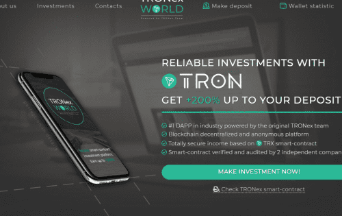

# Tronex World

Tronex V2 - 新的优化投资计划。
有限的定期存款，以确保长寿和维护平台。
每 100 万个 tron 存入 1% 基本 + 0.05%
初始存款的 200%

投资条件： 基本利率：每 24 小时 1% 个人持有红利：每 12 小时 +0.05%，无需提款 合约余额红利：平台余额每 1,000,00 TRX +0.05% 总收入：200% 最低存款： 100 TRX 每日限额：限额每 12 小时升级一次。 在服务器时间 00:00 和 12:00 联盟计划：10 级佣金：4%-2%-1%-0.5%-0.5%-0.5%-0.5%-0.5%-0.5%-0.5% 法律公司 TRONex LTD 经“GROX Solutions”审核 经“Telescr In”审核

