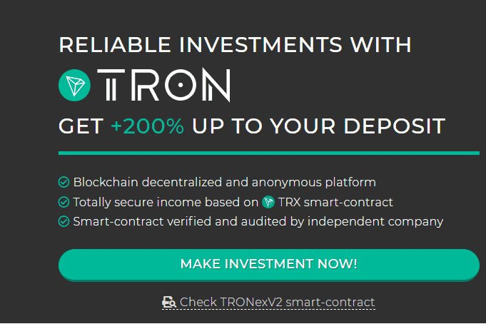

# TRONexV2

获得 +200% 的存款。
每 24 小时 +2%。
每 24 小时 +0.1% 且不退出
平台余额每 2,50,000 TRX +0.1%
没有后门。 巨大的可持续性。

TRONexV2 是一个投资回报率平台。 您可以投资并获得稳定的回报。 回报率最高可达 200% 以上。 每日投资回报率为 2%。 还有额外的奖金和福利。

TRONexV2 dApp 是一种基于 Tron 协议的高风险类别的加密资产。 现在，根据用户数量，它在一般 dApp 排名中排名第 4483 位，在高风险类别中排名第 2018 位，这让您可以很好地了解 TRONexV2 dApp 在其竞争对手中的表现。

