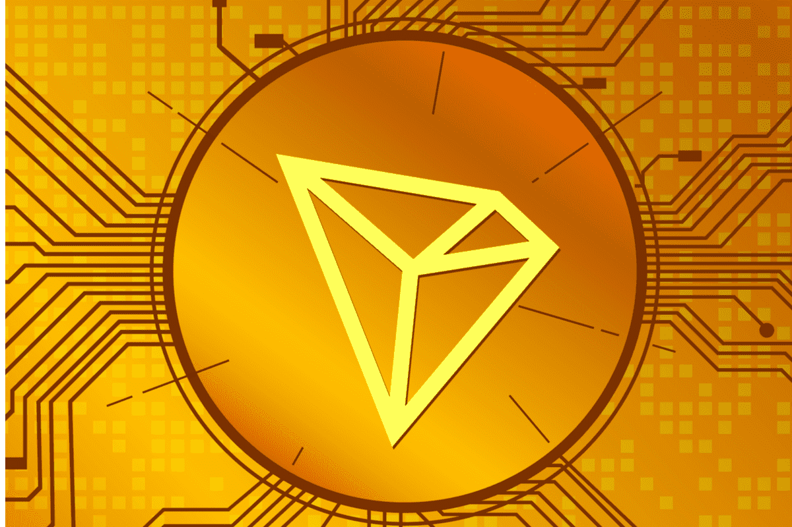

# TRONFAMILY

智能合约是基于TRON公链的Dapp去中心化投资平台。 拥有专业的智能合约审计报告，数据公开透明。一旦参与者触发合约，合约的所有条款都部署在区块链上。 合约代码将自动执行，任何人都无法篡改或被任何人控制。 每个人都可以查看和监督所有信息，智能合约没有什么可隐藏或欺骗的。
每日 %1,7 付款 - 从 0,7% 开始，每天加上 +0,1%，直到达到 1,7%
%10 推荐付款
121 天时为 200%
最低投资 200 TRX
最高投资 2,000,000 TRX

