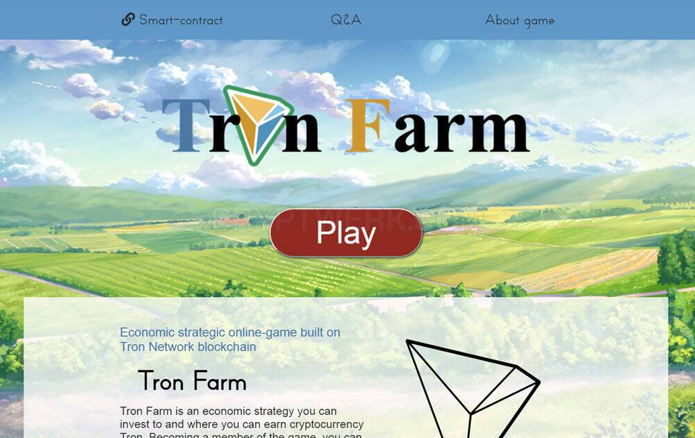

# TronFarm

游戏规则很简单——在农场投资一定数量（根据限制），一段时间后你会得到 + 15% 的存款金额。 利润可以逐步提取。 例如，如果您在第二阶段投资 100 TRX，那么在第三阶段结束时您将收到略多于 115 TRX。

Tron-Farm 是一个基于区块链的应用程序，您可以在其中拥有自己的农场，并可以在商店购买动物、饲养它们并出售它们以获取利润！

安全始于了解开发者如何收集和分享数据。数据隐私保护和安全措施可能会因您的使用情况、所在地区和用户年龄而异。此类信息由开发者提供，可能会随时间更新。

