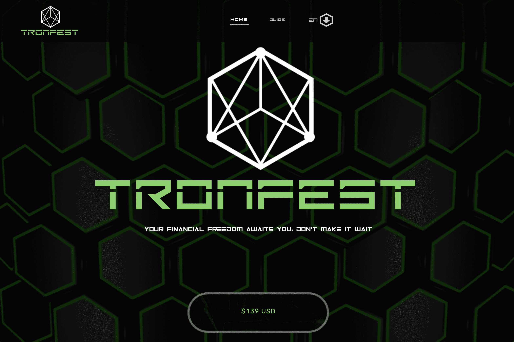

# TronFest

TronFest 是 TRON 区块链中的去中心化金融智能合约，它让您以 100 TRX（2.5 美元）的最低存款被动赚取收入，以实现收入增长 310%、直接推荐人佣金 10%、推荐人提款佣金 5%-30%

TronFest 是一个投资项目。 它基于 TRON 区块链。 使用 TronFest，您可以获得高达 310% 的投资回报率。 最低投资额为 100 TRX。 还有推荐奖金。

TronFest dApp 分析
触手可及的最重要的 TronFest dApp 指标 - 分析下面的深入图表，评估 dApp 在不同时间段的活动并做出快速、准确的决策！

