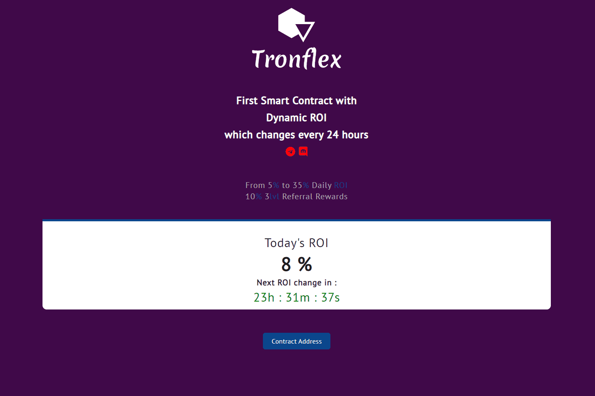

# Tronflex

Tronflex 在 tron 上带来了第一个动态 ROI dapp。 根据每 24 小时产生的随机投资回报率，每天赚取 5% 到 35% 的收益，并提取您的任何奖励
10% 推荐奖金。 100% 透明且经过验证的源代码

Tronflex 是一款基于 Tron 的动态 ROI dApp，每天可根据随机 ROI 提供 5% 至 35% 的收益。 该平台完全透明且经过验证。

Tronflex dApp 是一种基于 Tron 协议的高风险类别的加密资产。 现在，根据用户数量，它在一般 dApp 排名中排名第 2306 位，在高风险类别中排名第 735 位，这让您可以很好地了解 Tronflex dApp 在其竞争对手中的表现。

