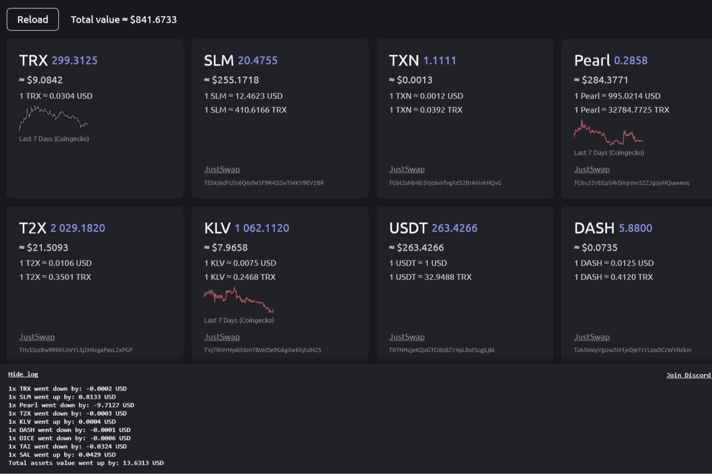

# TronFolio

TronFolio 通过为所有信息提供一个仪表板来解决试图跟上您的 Tron 代币余额和价值变化超时的问题。

TronFolio 是一种特定于 TRX 的等价于流行的投资组合项目，例如 Coingecko。 您可以在单个 dApp 中跟踪您持有的所有 TRX。 这使得事情比在各种钱包中漫游和进行手动计算要简单得多。 TronFolio 也有一个价格槽。 您将能够在任何给定时间点查看您的 TRX 价格！

TronFolio dApp 是基于 Tron 协议构建的 Other 类别的加密资产。 现在，根据用户数量，它在一般 dApp 排名中排名第 2692 位，在其他类别中排名第 288 位，这让您可以很好地了解 TronFolio dApp 在其竞争对手中的表现。

