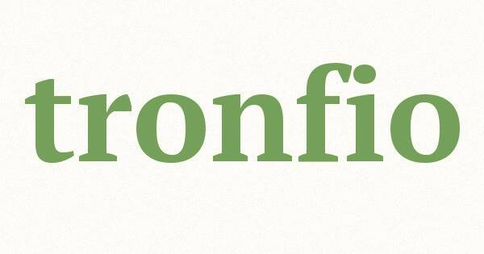

# TronFomo

TronFomo 是一款直接在 TRON 网络上运行的去中心化区块链游戏。
这是一个彩票游戏，最后一个在一轮结束时购买钥匙的人将赢得 JackPot！
在一轮中，人们可以购买 1 个或多个密钥，这会使计时器增加 30 秒，并将其标记为当前领导者（最后一个买家）。

TronFomo 是一款运行在 Tron 区块链上的去中心化游戏。 TronFomo 是一款彩票游戏，最后购买钥匙的人将赢得大奖。 回合开始后，人们可以购买 1 把或更多把钥匙来为回合增加 30 秒。 显然，主要目标是赢得奖品。

