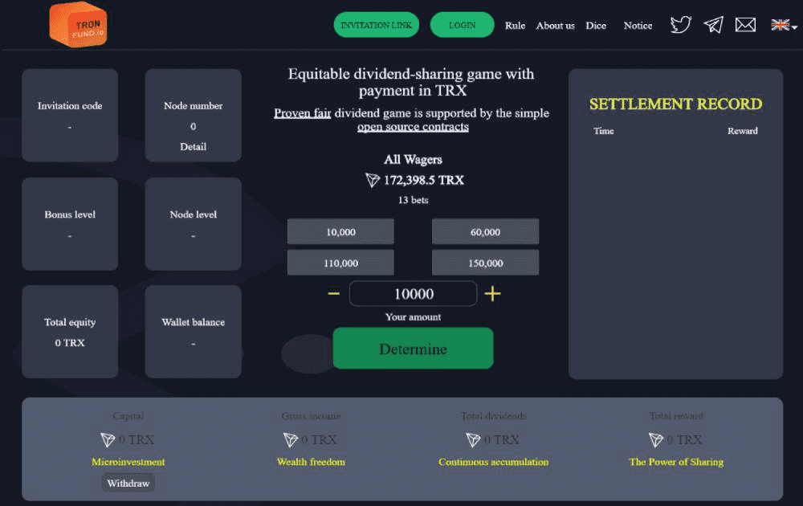

# TronFund.io

基于 TRON BlockChain 的 ROI 和在线赌场

TronFund.io 是一个双面 dApp。 一方面，您拥有赌场功能。 在这里，TronFund.io 是一个赌博项目。 但是，另一方面，TronFund.io 也具有 ROI 功能。 整个平台是去中心化的，并且基于 TRON。

TronFund.io dApp 是基于 Tron 协议构建的高风险类别的加密资产。 现在，根据用户数量，它在一般 dApp 排名中排名第 6259，在高风险类别中排名第 1504，这让您可以很好地了解 TronFund.io dApp 在其竞争对手中的表现。

通过分析过去 30 天窗口中的 TronFund.io dApp 数据，很明显 dApp 的余额为 0.66 美元，交易量稳定在 0.00 美元。 TronFund.io 在 30 天内产生了 0 笔交易，变化率为 0%。 显然，与之前的 7 天相比，成交量稳定了 0%。 最近 7 天的数据显示，TronFund.io 用户基数为 0，稳定了 0%。

