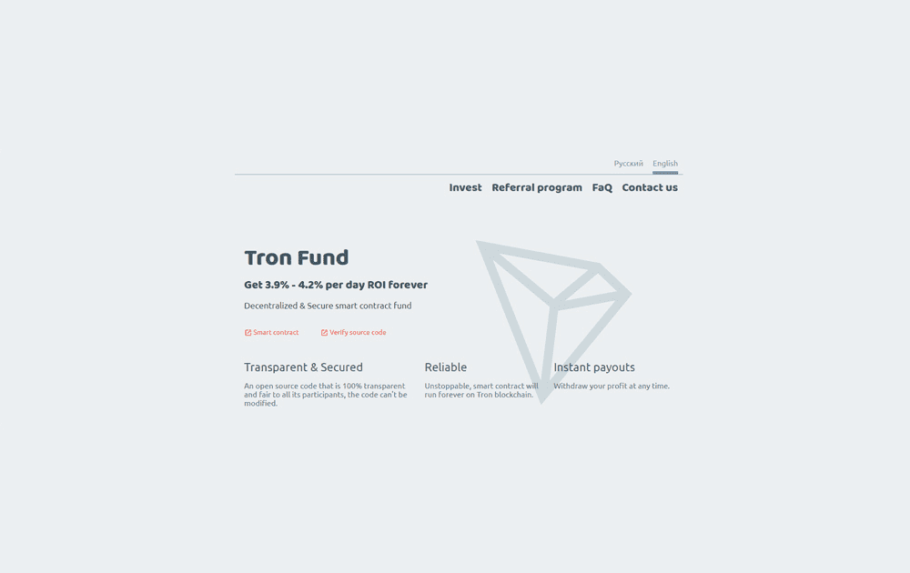

# TronFund

TronFund 是一个去中心化、透明、可靠和安全的基金。 作为 Tron 区块链上的智能合约运行。 增加您的 Tron 持股量，并永远获得每天 3.9% 至 4.2% 的投资回报率。 现在，您能够以安全和透明的方式产生股息。 即时支付，随时提取您的利润。

Tronfund是一家专注于孵化、天使投资、早期投资、并购、上市前和PIPE投资的首席投资公司。 该公司专门从事医疗保健领域的早期投资。 首次公开募股前投资，优先投资于首次公开募股后两年内的公司，重点关注天然气、新能源

