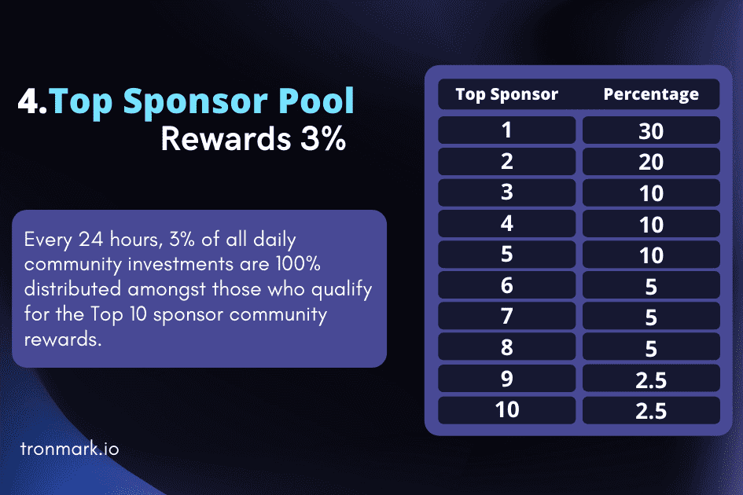

# Tronmark

投资.持有.赚取💹
🗣️推荐和奖励
您只需 1️⃣0️⃣0️⃣ 个 TRX 和 Limitless 即可作为社区合作伙伴参与。
🔰奖励类型🔰
1️⃣ 社区支持奖励1-3%
✅ 00-20 天 》1%
✅ 21-40 天 》2%
✅ 40+ 天     》3%
2️⃣ 赞助奖励 10%
每个投资和合同周期的 10% 直接赞助商奖励。
3️⃣ 社区级奖励（15 LEVEL）
根据直接赞助商及其团队每天 1% 的社区支持奖励，将每日社区级别奖励加速到可能的 15 个级别。
👥 1 级       >20%
👥 2-3 级     >10%
👥 4-6 级     >5%
👥 7 级       >4%
👥 8 级       >3%
👥 9-15 级 >2%
参考 15 解锁 15 个关卡。
4️⃣ 顶级赞助池奖励 3%
每 🕛24 小时，所有日常社区投资的 3% 将 100% 分配给有资格获得
前 10 名赞助商社区奖励。
#1   》 30%
#2   》 20%
#3   》 10%
#4   》 10%
#5   》 10%
#6  》 5%
#7  》 5%
#8   》 5%
#9   》 2.5%
#10》2.5%
Tronmark 有两种类型的合同。
1️⃣ 150% 合约
当累积到 150% 时，
（1 次被动，3 次通过营销/推荐计划）新投资必须相等或更高才能继续获得奖励。
2️⃣ 200% 合约
为了获得这份 200% 合同的资格，社区合作伙伴应在每个拥有 10,000TRX 的直接团队下推荐 3 名直接赞助商。

