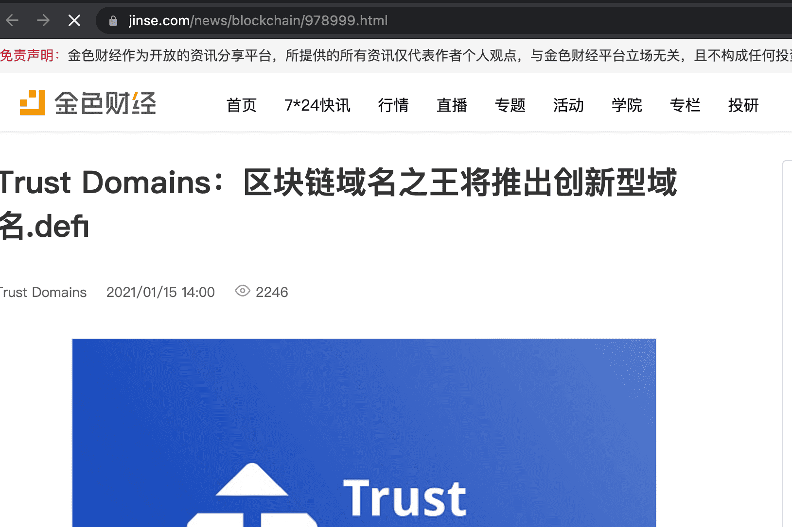

# Trust Domains

Trust Domains 是基于区块链技术的分布式域服务。这些域是符合 ERC721 的令牌。我们致力于打造跨链Web3.0金融基础设施。
信任域是符合 ERC721 的不可替代令牌。因此域是分散的，用户可以完全控制域和子域。可以使用支持 NFT 的钱包来转移域，就像许多其他 NFT 一样。
Trust Domains 有四个域名系统：

  DeFi 域名服务——部署在以太坊区块链上的域名服务。带有子前缀“.defi”的域
  Conflux 名称服务——这个域服务部署在 Conflux 区块链上。带有子前缀“.cfx”的域
  BSC 域名服务——该域名服务部署在币安智能链上。带有子前缀“.bnb”的域
  Heco 域名服务——部署在 HecoChain 上的域名服务。带有子前缀“.heco”的域

Trust Domains 遵循 ERC721 代币标准，因此用户可以通过支持 ERC721 代币的兼容钱包来管理他们的域，开发者可以轻松地将域集成到他们的 DAPP 中。

