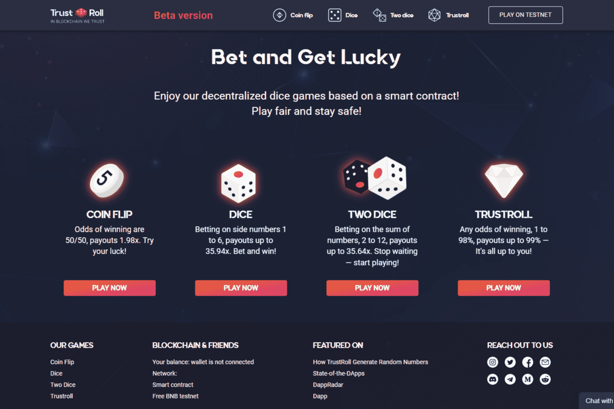

# TrustRoll

Trustroll 是一个基于币安智能链区块链，由智能合约控制的去中心化游戏平台。 Trustroll 以完全自动化和确定性的方式工作，保证公平的结果。 我们可以公开访问。 任何人都可以通过访问 https://bscscan.com 查看和检查智能合约代码以及交易历史。 无需注册或注册，这意味着最大的安全性和完全的匿名性。

Trustroll 是一个基于币安智能链区块链，由智能合约控制的去中心化游戏平台。

rustroll去中心化游戏平台让你赢BNB。 它基于智能合约并具有许多优点：

您可以调整获胜机会。 机会越小——获胜越大。
完全自动化和透明化。 我们已经录制了一个热视频来检查您的中奖结果。 不存在欺诈的可能性。
高速交易——您立即收到您的加密货币。
没有隐藏成本。 我们只收取 1% 的费用来维持平台的运行。

